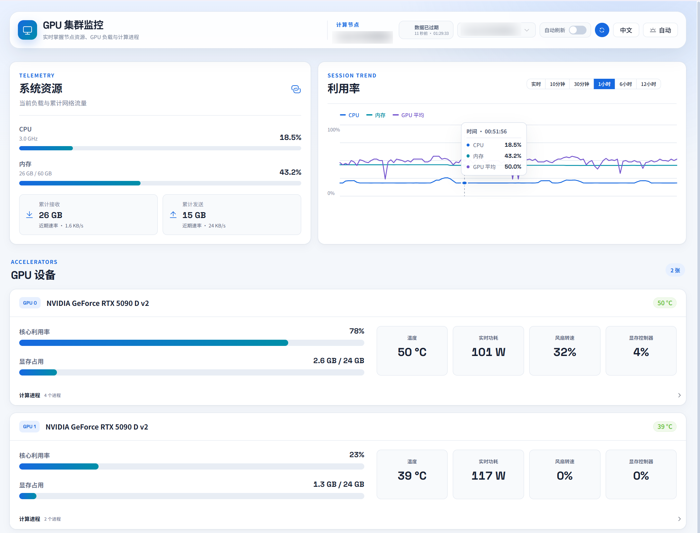

# GPUWebMonitor - GPU サーバークラスター監視ダッシュボード

[中文](README.md) | [English](README.en.md) | [日本語](README.ja.md)

[](LICENSE)
[](https://www.python.org/)
[](https://vuejs.org/)
[](https://flask.palletsprojects.com/)

**GPUWebMonitor** は、複数の GPU サーバーのリアルタイム状態、システムリソース、GPU プロセス情報を一つのダッシュボードから一元確認できる軽量な監視システムです。

> このプロジェクトは現在開発中です。信頼できるイントラネットまたは管理されたテスト環境での利用を推奨します。現時点では本番環境への直接導入は推奨しません。



## 機能

- **複数サーバーの集中監視**: Dashboard から複数の Agent ノードをまとめて確認
- **リアルタイム更新**: 手動更新と 3 秒間隔の自動更新に対応
- **GPU 監視**: コア使用率、VRAM 使用量、温度、消費電力、ファン速度、メモリコントローラー使用率
- **プロセス監視**: GPU ごとの計算プロセス PID、ユーザー、GPU メモリ使用量、コマンドライン
- **システムリソース**: CPU 使用率と周波数、メモリ使用量、ネットワーク累積送受信とリアルタイム速度
- **使用率トレンドチャート**: CPU / メモリ / GPU 平均の SVG 折れ線グラフ。リアルタイムモードと履歴モード（10分、30分、1時間、6時間、12時間）に対応
- **履歴データ記録**: Agent が 30 秒ごとに SQLite へ書き込み、デフォルトで 30 日間保持
- **3 言語対応**: 中文、English、日本語。ブラウザの言語設定を自動検出
- **テーマ切替**: 自動 / ライト / ダークの 3 モード。システム設定に追従
- **レスポンシブデザイン**: デスクトップ、タブレット、モバイルに対応し、レイアウトを自動切替
- **自己完結型デプロイ**: フロントエンド資産はすべてローカル配信。外部 CDN 依存なし

## アーキテクチャ

```text
ブラウザ
  |
  | Dashboard にアクセス: http://<dashboard-host>:28456
  v
Dashboard サービス backend/dashboard.py
  |
  | front/config.json を読み込み、選択された Agent へリクエストをプロキシ
  v
Agent サービス backend/app.py
  |
  | nvitop / NVML / psutil でデータ収集
  v
GPU とシステム状態
```

デフォルトポート:

| サービス | ファイル | デフォルトポート | 説明 |
| --- | --- | ---: | --- |
| Agent | `backend/app.py` | `15896` | 監視対象の各 GPU サーバーで実行 |
| Dashboard | `backend/dashboard.py` | `28456` | 監視入口。Agent と同じマシンで動かすことも可能 |

## 要件

- Python 3.12+
- NVIDIA ドライバーと利用可能な NVML 環境
- 監視対象ノードで `nvidia-smi` が正常に実行可能
- Linux では systemd によるサービス管理を推奨

## クイックスタート

### 1. プロジェクトをクローン

```bash
git clone https://github.com/University-Pro/GPUWebMonitor.git
cd GPUWebMonitor
```

### 2. Python 環境を作成

専用の Python 環境を作成することを推奨します。`venv` または `conda` を選んでください。

`venv` を使用する場合:

```bash
python -m venv .venv
source .venv/bin/activate
```

`conda` を使用する場合:

```bash
conda create -n gpuwebmonitor python=3.12
conda activate gpuwebmonitor
```

環境を有効化した後、Python パスを確認:

```bash
where python    # Windows
which python    # Linux / macOS
```

systemd を設定する際は、この絶対パスを `ExecStart` に指定してください。

### 3. バックエンド依存関係をインストール

Dashboard サーバーと各 Agent サーバーで実行:

```bash
cd backend
pip install -r requirements.txt
```

### 4. サーバーリストを設定

`front/config.json` を編集し、各 Agent を `servers` に追加:

```json
{
  "servers": [
    {
      "id": "server1",
      "name": "5090D サーバー",
      "url": "http://192.168.30.107:15896"
    },
    {
      "id": "server2",
      "name": "4090 サーバー",
      "url": "http://192.168.30.16:15896"
    }
  ]
}
```

| フィールド | 説明 |
| --- | --- |
| `id` | ノードの一意な ID。英数字やハイフンを推奨 |
| `name` | フロントエンドに表示される名前 |
| `url` | Agent サービスの URL。デフォルトポートは `15896` |

### 5. Agent を起動

監視対象の各 GPU サーバーで実行:

```bash
cd backend
python app.py
```

Agent の動作確認:

```bash
curl http://127.0.0.1:15896/
curl http://127.0.0.1:15896/api/status
```

### 6. Dashboard を起動

監視入口サーバーで実行:

```bash
cd backend
python dashboard.py
```

ブラウザで開く:

```text
http://<dashboard-host>:28456
```

ローカルアクセス:

```text
http://127.0.0.1:28456
```

## systemd デプロイ

### Agent サービス

Python パスを確認した後、`/etc/systemd/system/gpu-monitor-agent.service` を作成:

```ini
[Unit]
Description=GPU Monitor Agent
After=network.target

[Service]
User=YOUR_USER
Group=YOUR_GROUP
WorkingDirectory=/path/to/GPUWebMonitor/backend
ExecStart=/path/to/python app.py
Restart=on-failure
RestartSec=5s

[Install]
WantedBy=multi-user.target
```

### Dashboard サービス

`/etc/systemd/system/gpu-monitor-dashboard.service` を作成:

```ini
[Unit]
Description=GPU Monitor Dashboard
After=network.target

[Service]
User=YOUR_USER
Group=YOUR_GROUP
WorkingDirectory=/path/to/GPUWebMonitor/backend
ExecStart=/path/to/python dashboard.py
Restart=on-failure
RestartSec=5s

[Install]
WantedBy=multi-user.target
```

サービスを有効化して起動:

```bash
sudo systemctl daemon-reload
sudo systemctl enable --now gpu-monitor-agent
sudo systemctl enable --now gpu-monitor-dashboard
```

状態とログを確認:

```bash
systemctl status gpu-monitor-agent
systemctl status gpu-monitor-dashboard
journalctl -u gpu-monitor-agent -f
journalctl -u gpu-monitor-dashboard -f
```

## 設定

### Agent 設定

主な設定は `backend/app.py` の先頭にあります:

| 設定 | デフォルト | 説明 |
| --- | ---: | --- |
| `PORT` | `15896` | Agent の待ち受けポート |
| `RECORD_INTERVAL` | `30` | 履歴データの収集間隔（秒） |
| `KEEP_HISTORY_DAYS` | `30` | SQLite 履歴データの保持日数 |
| `DB_FILE` | `backend/monitor_data.db` | 履歴データファイルのパス |

### Dashboard 設定

Dashboard は `front/config.json` を読み込み、`/api/proxy?id=<server_id>` を通じてリクエストを Agent に転送します。

## API

### Agent

| メソッド | パス | 説明 |
| --- | --- | --- |
| `GET` | `/` | ヘルスチェック |
| `GET` | `/api/status` | 現在の GPU とシステム状態を取得 |
| `GET` | `/api/history?limit=100` | 履歴データを取得。`limit` の最大値は 1000 |

### Dashboard

| メソッド | パス | 説明 |
| --- | --- | --- |
| `GET` | `/` | フロントエンドページ |
| `GET` | `/api/config` | サーバー設定を取得 |
| `GET` | `/api/proxy?id=<server_id>` | Agent へリクエストをプロキシ。`history=1&limit=N` で履歴データ取得に対応 |

## プロジェクト構成

```text
GPUWebMonitor/
├── backend/
│   ├── app.py             # Agent サービス。監視対象サーバーで実行
│   ├── dashboard.py       # Dashboard サービス。フロントエンド配信とリクエスト転送
│   ├── gpu_monitor.py     # GPU とシステム指標の収集ロジック
│   ├── stress.py          # ストレステストスクリプト
│   └── requirements.txt   # Python 依存関係
├── front/
│   ├── index.html         # フロントエンドページ
│   ├── app.js             # フロントエンドアプリケーションロジック
│   ├── style.css          # フロントエンドスタイル
│   ├── config.json        # 監視対象サーバー設定
│   ├── vendor/            # ローカル化されたフロントエンド依存関係
│   │   ├── vue.global.prod.js
│   │   ├── element-plus.js
│   │   ├── element-plus.css
│   │   └── element-plus-icons.js
│   └── favicon / icon     # ブラウザーアイコン素材
├── pictures/
│   └── readme1.png        # README プレビュー画像
├── LICENSE
└── README.md
```

## 技術スタック

- **バックエンド**: Python、Flask、Flask-CORS、nvitop、psutil、SQLite
- **フロントエンド**: Vue 3、Element Plus、バニラ JavaScript（ビルドステップなし）
- **デプロイ**: Python サービスを直接実行、または systemd で管理

## トラブルシューティング

### Dashboard がサーバーリストを読み込めない

- Dashboard が `http://<dashboard-host>:28456` で起動していることを確認
- `front/config.json` が有効な JSON であることを確認
- Dashboard ログに設定ファイルパスや JSON パースエラーが出ていないか確認

### 特定ノードからデータを取得できない

- 対象 Agent が起動していることを確認: `curl http://<agent-host>:15896/api/status`
- Dashboard サーバーから Agent URL に到達できることを確認
- `front/config.json` の該当ノードの `url` に正しいポートが含まれているか確認

### GPU 情報が空、または権限が不足している

- NVIDIA ドライバーがインストールされ、`nvidia-smi` が正常に動作することを確認
- Agent を実行しているユーザーに GPU とプロセス情報を読み取る権限があることを確認
- 他ユーザー所有プロセスの完全なコマンドラインを表示するには、権限の昇格が必要な場合があります

### ポートが使用中

```bash
ss -ltnp | grep -E '15896|28456'
```

ポートを変更する場合: `backend/app.py` の `PORT` と `backend/dashboard.py` の `app.run(..., port=28456)` を変更してください。

## ライセンス

このプロジェクトは GNU General Public License v3.0 のもとで公開されています。詳細は [LICENSE](LICENSE) を参照してください。

## 謝辞

- [nvitop](https://github.com/XuehaiPan/nvitop)
- [psutil](https://github.com/giampaolo/psutil)
- [Vue](https://vuejs.org/)
- [Element Plus](https://element-plus.org/)
