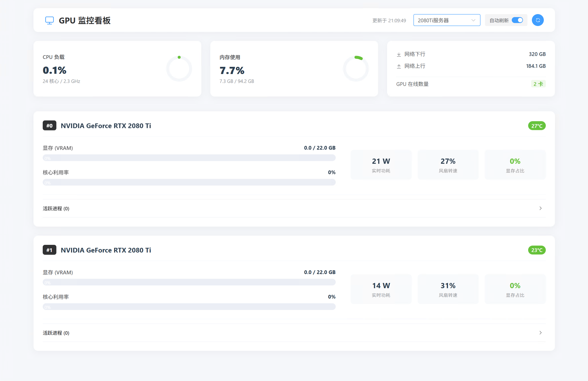

# ServerMonitor - GPU服务器集群监控系统

[](LICENSE)
[](https://www.python.org/)
[](https://vuejs.org/)
[](https://flask.palletsprojects.com/)

**ServerMonitor** 是一个专为GPU服务器集群设计的现代化监控系统，提供实时的GPU状态、系统指标和进程监控。



## ✨ 功能特性

### 🚀 核心功能
- **多服务器监控** - 支持同时监控多个GPU服务器
- **实时数据刷新** - 默认30秒自动刷新，实时掌握服务器状态
- **历史数据记录** - 自动保存7天历史监控数据
- **进程级监控** - 详细显示GPU上运行的进程信息

### 📊 监控指标
- **GPU状态** - 利用率、显存使用、温度、功耗、风扇速度
- **系统资源** - CPU使用率、内存使用率、网络流量
- **进程信息** - PID、进程名、用户名、显存占用、命令行

### 🛠 技术特性
- **现代化界面** - Vue 3 + Element Plus构建的响应式Web界面
- **权限友好** - 智能处理NVML权限问题，支持回退机制
- **容器化部署** - 支持Docker一键部署
- **配置灵活** - JSON配置文件轻松管理监控服务器

## 🏗 系统架构

```
┌─────────────────┐    ┌──────────────────┐    ┌─────────────────┐
│   前端界面       │    │   Dashboard服务  │    │    Agent服务     │
│   (Vue 3)       │◄──►│   (dashboard.py) │◄──►│   (app.py)      │
│                 │    │   端口: 8080      │    │   端口: 5000     │
└─────────────────┘    └──────────────────┘    └─────────────────┘
         │                        │                       │
         │                        │                       ▼
         │                        │            ┌─────────────────┐
         │                        │            │  GPU监控模块    │
         │                        │            │ (gpu_monitor.py)│
         │                        │            └─────────────────┘
         ▼                        ▼
┌─────────────────┐    ┌──────────────────┐
│   用户浏览器     │    │  配置文件        │
│                 │    │  (config.json)   │
└─────────────────┘    └──────────────────┘
```

## 📦 安装部署

### 环境要求
- **Python 3.8+**（后端服务）
- **Node.js**（前端开发，生产环境已预编译）
- **Docker**（可选，容器化部署）
- **NVIDIA驱动**（被监控服务器）

### 快速开始

#### 1. 克隆项目
```bash
git clone <项目地址>
cd servermonitor
```

#### 2. 后端Agent服务（每台被监控服务器）
```bash
cd backend

# 安装依赖
pip install -r requirements.txt
# 或使用Docker
docker build -t servermonitor-agent .
docker run -d -p 5000:5000 --name agent servermonitor-agent
```

#### 3. Dashboard服务（中央监控面板）
```bash
cd backend
python dashboard.py
# 或使用Docker（待实现）
```

#### 4. 前端服务
```bash
cd front

# 生产环境直接使用（已预编译）
# 或使用Docker
docker build -t servermonitor-front .
docker run -d -p 80:80 --name front servermonitor-front
```

### Docker Compose一键部署
```yaml
# docker-compose.yml（示例）
version: '3'
services:
  agent1:
    build: ./backend
    ports:
      - "5000:5000"
    environment:
      - SERVER_NAME=服务器1

  agent2:
    build: ./backend
    ports:
      - "5001:5000"
    environment:
      - SERVER_NAME=服务器2

  dashboard:
    build: ./backend
    ports:
      - "8080:8080"
    volumes:
      - ./front/config.json:/app/config.json

  frontend:
    build: ./front
    ports:
      - "80:80"
    depends_on:
      - dashboard
```

## 🔧 配置说明

### 服务器配置（`front/config.json`）
```json
{
  "servers": [
    {
      "id": "server1",
      "name": "2080Ti服务器",
      "url": "http://192.168.30.246:25520"
    },
    {
      "id": "server2",
      "name": "5090D服务器",
      "url": "http://172.17.175.247:5000"
    }
  ]
}
```

### Agent配置（`backend/app.py`）
- **端口**: 默认5000（可在代码中修改）
- **数据保留**: 默认7天（可修改`cleanup_days`参数）
- **刷新间隔**: 默认5秒采集一次数据

## 🎯 使用方法

### 1. 启动服务
```bash
# 启动Agent服务（每台被监控服务器）
cd backend
python app.py

# 启动Dashboard服务（监控中心）
python dashboard.py

# 访问前端界面
# 浏览器打开 http://localhost:8080
```

### 2. 访问监控面板
1. 打开浏览器访问Dashboard服务地址（默认:8080）
2. 系统会自动加载配置的服务器列表
3. 点击服务器卡片查看详细信息
4. 使用右上角刷新按钮或等待自动刷新

### 3. 监控数据解读
- **GPU利用率**: 0-100%，表示GPU计算核心使用率
- **显存使用**: 已使用/总显存，单位MB
- **温度**: GPU核心温度，单位℃
- **功耗**: GPU当前功耗，单位W
- **进程列表**: 显示当前占用GPU的进程详情

## 📡 API接口

### Agent服务接口（端口:5000）
```
GET /api/status       # 获取当前系统状态
GET /api/history      # 获取历史监控数据
```

### Dashboard服务接口（端口:8080）
```
GET /                 # 前端页面
GET /api/config       # 获取服务器配置
POST /api/proxy       # 代理请求到Agent服务器
```

## 📁 项目结构

```
servermonitor/
├── backend/                  # 后端服务
│   ├── app.py               # Agent服务（运行在被监控服务器）
│   ├── dashboard.py         # Dashboard服务（中央监控面板）
│   ├── gpu_monitor.py       # GPU监控核心模块
│   ├── Dockerfile           # Agent服务Docker配置
│   └── requirements.txt     # Python依赖
├── front/                   # 前端界面
│   ├── index.html           # 主页面（Vue 3 + Element Plus）
│   ├── config.json          # 服务器配置文件
│   └── Dockerfile           # 前端Docker配置
├── docker-compose.yml       # Docker Compose配置（示例）
└── README.md               # 项目说明文档
```

## 🧪 技术栈

### 后端
- **Python 3.8+** - 主要编程语言
- **Flask** - Web框架
- **nvitop** - GPU监控库
- **psutil** - 系统监控库
- **SQLite** - 轻量级数据库

### 前端
- **Vue 3** - 前端框架
- **Element Plus** - UI组件库
- **原生JavaScript** - 业务逻辑

### 部署
- **Docker** - 容器化部署
- **Nginx** - Web服务器（前端）

## 🔍 故障排查

### 常见问题

#### 1. NVML权限问题
```
错误: NVML权限不足
解决方案: 使用sudo运行或配置NVML权限
```

#### 2. 端口冲突
```bash
# 检查端口占用
netstat -tulpn | grep :5000
# 或修改app.py/dashboard.py中的端口配置
```

#### 3. 数据不更新
- 检查Agent服务是否正常运行
- 确认网络连通性
- 查看浏览器控制台错误信息

### 日志查看
```bash
# Agent服务日志
cd backend
tail -f app.log

# Docker容器日志
docker logs agent-container-name
```

## 🤝 贡献指南

欢迎提交Issue和Pull Request！

1. Fork本仓库
2. 创建功能分支 (`git checkout -b feature/AmazingFeature`)
3. 提交更改 (`git commit -m 'Add some AmazingFeature'`)
4. 推送到分支 (`git push origin feature/AmazingFeature`)
5. 开启Pull Request

## 📄 许可证

本项目基于MIT许可证开源 - 查看[LICENSE](LICENSE)文件了解详情。

## 🙏 致谢

- [nvitop](https://github.com/XuehaiPan/nvitop) - 优秀的GPU监控工具
- [psutil](https://github.com/giampaolo/psutil) - 跨平台系统监控库
- [Element Plus](https://element-plus.org/) - 优秀的Vue 3 UI组件库

## 📞 联系支持

- **问题反馈**: [GitHub Issues](https://github.com/your-repo/issues)
- **功能建议**: 欢迎提交Feature Request

---

**Made with ❤️ for GPU服务器监控**

> 如果这个项目对你有帮助，请点个Star支持一下！